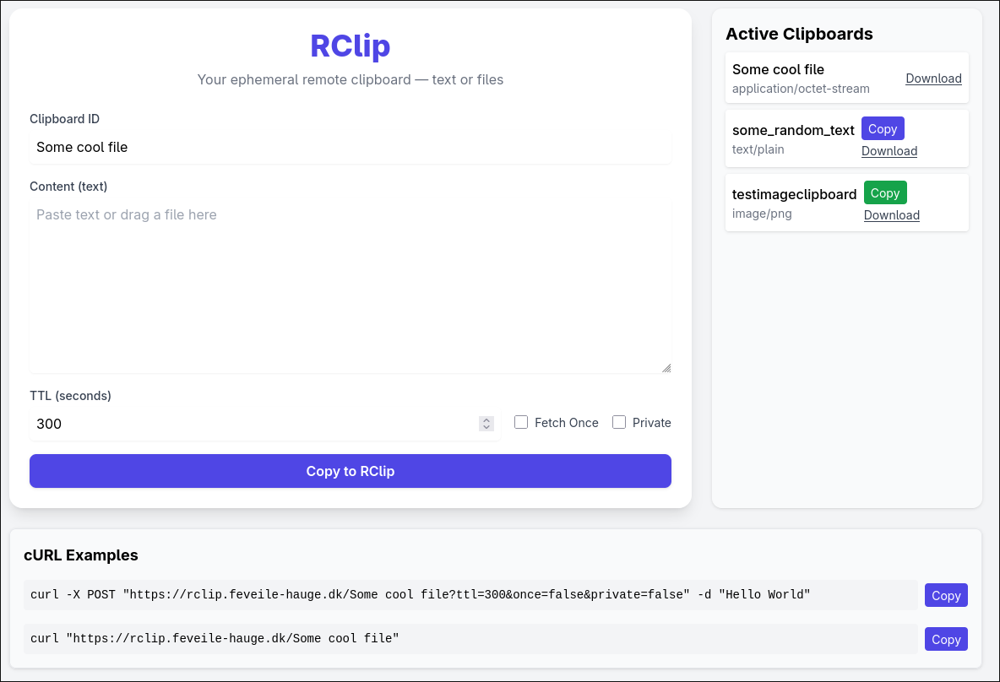

# Rclip

*R*emote *clip*board solution.



## Hosted

Solution can be hosted with docker:

```bash
docker run -d -p 80:80 danielhauge/rclip
```

This will provide a hosted site at `http://localhost` where you can store and retrieve clipboard data via a web site.

## API

Clipboards can be posted and retrieved via simple HTTP requests.

Store clipboard data:

```bash
curl -X POST http://localhost/any-clipboard-id -d "My clipboard data
```

Retrieve clipboard data:

```bash
curl http://localhost/any-clipboard-id
```

Store any file as clipboard data:

```bash
curl -X POST http://localhost/any-clipboard-id --data-binary @myfile.txt
curl -X POST http://localhost/any-clipboard-id -F "file=@myfile.pdf"    
```

### Query parameters

- `?once=true` - When retrieving clipboard data, it will be deleted after the first retrieval.
- `?ttl=SECONDS` - When storing clipboard data, it will be deleted after the specified number of seconds.
- `?private=true` - When storing clipboard data, it will not be showing on active clipboards list, thus retrieving it requires knowing the clipboard ID.
